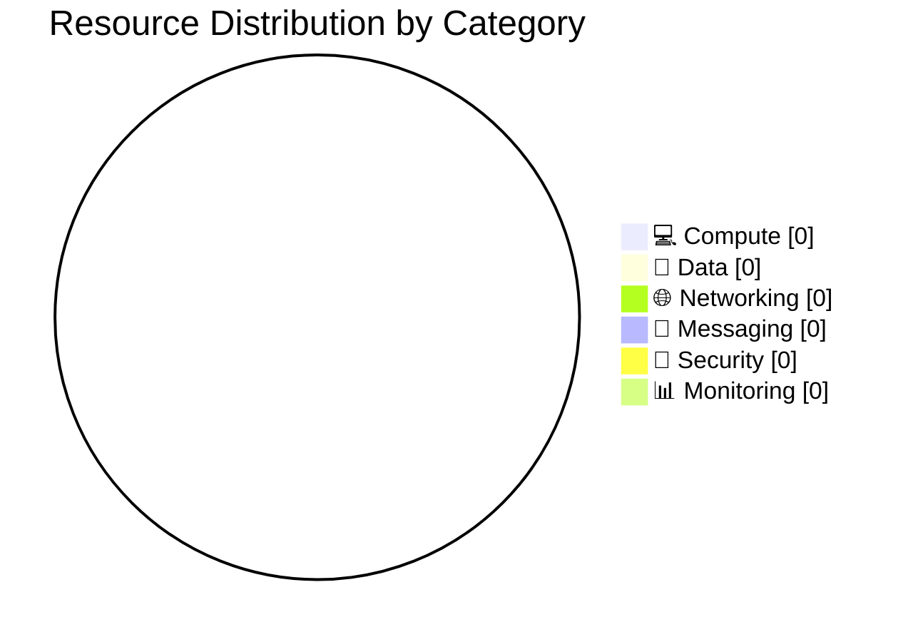

# 📦 Resource Inventory: {project-name}

<strong>📑 Inventory Contents</strong>

- [📊 Summary](#-summary)
- [📦 Resource Listing](#-resource-listing)
- [References](#references)

> Generated by {agent} agent | {date}

| ⬅️ Previous                                          | 📑 Index            | Next ➡️                                      |
| ---------------------------------------------------- | ------------------- | -------------------------------------------- |
| [07-operations-runbook.md](07-operations-runbook.md) | [README](README.md) | [07-backup-dr-plan.md](07-backup-dr-plan.md) |

**Generated**: {date}
**Source**: Infrastructure as Code (Bicep)
**Environment**: {environment}
**Region**: {region}

---

## 📊 Summary

| Category            | Count |
| ------------------- | ----- |
| **Total Resources** | {n}   |
| 💻 Compute          | {n}   |
| 💾 Data Services    | {n}   |
| 🌐 Networking       | {n}   |
| 📨 Messaging        | {n}   |
| 🔐 Security         | {n}   |
| 📊 Monitoring       | {n}   |

---

## 📦 Resource Listing

### 💻 Compute Resources

| Name   | Type   | SKU   | Location   | Monthly Cost | Purpose   | Portal                                                     |
| ------ | ------ | ----- | ---------- | ------------ | --------- | ---------------------------------------------------------- |
| {name} | {type} | {sku} | {location} | ${X}         | {purpose} | [View](https://portal.azure.com/#@/resource/{resource-id}) |

### 💾 Data Services

| Name   | Type   | SKU   | Configuration | Location   | Monthly Cost |
| ------ | ------ | ----- | ------------- | ---------- | ------------ |
| {name} | {type} | {sku} | {config}      | {location} | ${X}         |

### 🌐 Networking Resources

| Name   | Type   | Configuration | Location   |
| ------ | ------ | ------------- | ---------- |
| {name} | {type} | {config}      | {location} |

### 📨 Messaging Resources

| Name   | Type   | SKU   | Configuration | Location   |
| ------ | ------ | ----- | ------------- | ---------- |
| {name} | {type} | {sku} | {config}      | {location} |

### 🔐 Security Resources

| Name   | Type   | Configuration | Location   |
| ------ | ------ | ------------- | ---------- |
| {name} | {type} | {config}      | {location} |

### 📊 Monitoring Resources

| Name   | Type   | Retention   | Location   |
| ------ | ------ | ----------- | ---------- |
| {name} | {type} | {retention} | {location} |

---

> Replace values with actual resource counts per category.

---

## References

| Topic                | Link                                                                                                                   |
| -------------------- | ---------------------------------------------------------------------------------------------------------------------- |
| Azure Resource Types | [Resource Providers](https://learn.microsoft.com/azure/azure-resource-manager/management/resource-providers-and-types) |
| Naming Conventions   | [CAF Naming](https://learn.microsoft.com/azure/cloud-adoption-framework/ready/azure-best-practices/resource-naming)    |
| Pricing Calculator   | [Azure Pricing](https://azure.microsoft.com/pricing/calculator/)                                                       |

---

_Resource inventory generated from Bicep templates._

---

| ⬅️ [07-operations-runbook.md](07-operations-runbook.md) | 🏠 [Project Index](README.md) | ➡️ [07-backup-dr-plan.md](07-backup-dr-plan.md) |
| ------------------------------------------------------- | ----------------------------- | ----------------------------------------------- |

