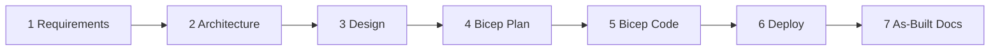

<!-- markdownlint-disable MD013 MD033 MD041 -->

<a id="readme-top"></a>

[![MIT License][license-shield]][license-url]
[![Azure][azure-shield]][azure-url]

<div align="center">
  
</div>

<br />
<div align="center">
  <a href="https://github.com/jonathan-vella/azure-agentic-infraops-accelerator">
    
  </a>

  <h1 align="center">Agentic InfraOps Accelerator</h1>

  <p align="center">
    <strong>Your project, powered by the Agentic InfraOps framework</strong>
    <br />
    <em>Everything pre-wired. You own the outputs.</em>
    <br /><br />
    <a href="#-getting-started"><strong>Get Started »</strong></a>
    ·
    <a href="docs/quickstart.md">Quickstart Guide</a>
    ·
    <a href="docs/workflow.md">Workflow Reference</a>
    ·
    <a href="https://github.com/jonathan-vella/azure-agentic-infraops">Upstream Repo</a>
  </p>
</div>

---

This repository was created from the
[azure-agentic-infraops](https://github.com/jonathan-vella/azure-agentic-infraops) template.
It includes the complete multi-agent orchestration system for Azure infrastructure development —
agents, skills, MCP servers, CI workflows, and devcontainer — all pre-wired and ready to use.

You own your project outputs. The framework syncs from upstream automatically.

---

## What's Included

Everything from the upstream framework arrives pre-configured:

| Component         | Location                   | Purpose                          |
| ----------------- | -------------------------- | -------------------------------- |
| **Agents**        | `.github/agents/`          | 8 specialized agents + conductor |
| **Skills**        | `.github/skills/`          | Reusable knowledge modules       |
| **Instructions**  | `.github/instructions/`    | Copilot behavior rules           |
| **MCP Servers**   | `.vscode/mcp.json`, `mcp/` | Azure MCP + Pricing MCP          |
| **Dev Container** | `.devcontainer/`           | All tools pre-installed          |
| **CI Workflows**  | `.github/workflows/`       | Linting, validation, weekly sync |
| **Scripts**       | `scripts/`                 | Validation and utility scripts   |

---

## 🚀 Getting Started

### Prerequisites

| Requirement            | How to Get                                                  |
| ---------------------- | ----------------------------------------------------------- |
| GitHub account         | [Sign up](https://github.com/signup)                        |
| GitHub Copilot license | [Get Copilot](https://github.com/features/copilot)          |
| VS Code                | [Download](https://code.visualstudio.com/)                  |
| Docker Desktop         | [Download](https://www.docker.com/products/docker-desktop/) |
| Azure subscription     | Optional for learning                                       |

### Step 1: Create your repository from this template

Click **Use this template → Create a new repository** at the top of this page.

Clone your new repository:

```bash
git clone https://github.com/YOUR-USERNAME/YOUR-REPO-NAME.git
code YOUR-REPO-NAME
```

Update all template repository references to your new repository:

```bash
npm run init:template
```

Optional preview mode:

```bash
npm run init:template:dry-run
```

### Step 2: Open in Dev Container

1. Press `F1` → **Dev Containers: Reopen in Container** _(first build: ~2-3 min)_

The Dev Container installs all tools automatically:

- Azure CLI + Bicep CLI
- PowerShell 7
- Python 3 + diagrams library
- 25+ VS Code extensions

### Step 3: Enable subagent orchestration and start the Conductor

Add this to your **VS Code User Settings** (`Ctrl+,` → Settings JSON):

```json
{ "chat.customAgentInSubagent.enabled": true }
```

Then:

1. Press `Ctrl+Shift+I` to open Copilot Chat
2. Select **InfraOps Conductor** from the agent dropdown
3. Describe your infrastructure project

```text
Create a web app with Azure App Service, Key Vault, and SQL Database
in Sweden Central for a production workload
```

The Conductor guides you through all 7 steps with human approval gates.

📖 **[Full Quickstart Guide →](docs/quickstart.md)**

<p align="right">(<a href="#readme-top">back to top</a>)</p>

---

## What You Own

These paths belong to your project and are **never overwritten** by upstream sync:

| Path              | Purpose                                 |
| ----------------- | --------------------------------------- |
| `agent-output/`   | All generated artifacts from agent runs |
| `infra/bicep/`    | Your Bicep templates                    |
| `docs/`           | Your project documentation              |
| `README.md`       | This file                               |
| `CHANGELOG.md`    | Your release history                    |
| `VERSION.md`      | Your version source of truth            |
| `CONTRIBUTING.md` | Your contribution guidelines            |
| `CONTRIBUTORS.md` | Your contributor credits                |
| `package.json`    | Your package identity and version       |

<p align="right">(<a href="#readme-top">back to top</a>)</p>

---

## How Upstream Sync Works

A weekly GitHub Actions workflow (`weekly-upstream-sync.yml`) fetches the latest framework
improvements from [jonathan-vella/azure-agentic-infraops](https://github.com/jonathan-vella/azure-agentic-infraops)
and opens a pull request for human review. **No auto-merge.**

Framework files sync automatically (agents, skills, instructions, MCP, devcontainer, scripts).
Your consumer-owned files listed above are never touched.

**Reviewing sync PRs**: Check the PR diff. Occasionally review upstream `package.json` and
`docs/` changes manually — these don't arrive via sync and must be ported by hand if needed.

<p align="right">(<a href="#readme-top">back to top</a>)</p>

---

## The 7-Step Workflow



All outputs go to `agent-output/{project}/` and `infra/bicep/{project}/`.

📖 **[Full Workflow Reference →](docs/workflow.md)**

<p align="right">(<a href="#readme-top">back to top</a>)</p>

---

## Upstream & Contributing

This repository is a template consumer of the upstream framework.

- **Agent/skill/instruction improvements** → contribute to the
  [upstream repo](https://github.com/jonathan-vella/azure-agentic-infraops)
- **Project-specific infrastructure, CI, and docs** → contribute here

See [CONTRIBUTING.md](CONTRIBUTING.md) for details and [LICENSE](LICENSE) for license terms.

<p align="right">(<a href="#readme-top">back to top</a>)</p>

---

<div align="center">
  <p>Powered by <a href="https://github.com/jonathan-vella/azure-agentic-infraops">Agentic InfraOps</a> &mdash; MIT License</p>
</div>

<!-- MARKDOWN LINKS & IMAGES -->

[license-shield]: https://img.shields.io/github/license/jonathan-vella/azure-agentic-infraops-accelerator.svg?style=for-the-badge
[license-url]: https://github.com/jonathan-vella/azure-agentic-infraops-accelerator/blob/main/LICENSE
[azure-shield]: https://img.shields.io/badge/Azure-Ready-0078D4?style=for-the-badge&logo=microsoftazure&logoColor=white
[azure-url]: https://azure.microsoft.com
